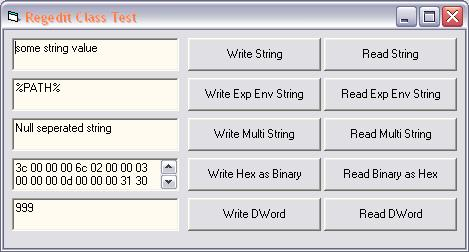



## Easy\-to\-use Registry Editing Class

### Description

Easy to use Class Module for reading & writing Registry values. Supports String, Multi-String, Expandable-String, Dword and Binary Registry data types.

The code sample is a complete Project that shows how to use the Class for reading and writing all supported data types.
 
### More Info
 

             |
---                |---
**Submitted On**   |2002-08-01 00:03:40
**By**             |[Chod](https://github.com/Planet-Source-Code/PSCIndex/blob/master/ByAuthor/chod.md)
**Level**          |Intermediate
**User Rating**    |5.0 (40 globes from 8 users)
**Compatibility**  |VB 6\.0
**Category**       |[Registry](https://github.com/Planet-Source-Code/PSCIndex/blob/master/ByCategory/registry__1-36.md)
**World**          |[Visual Basic](https://github.com/Planet-Source-Code/PSCIndex/blob/master/ByWorld/visual-basic.md)
**Archive File**   |[Easy\-to\-us1129947312002\.zip](https://github.com/Planet-Source-Code/chod-easy-to-use-registry-editing-class__1-37463/archive/master.zip)

